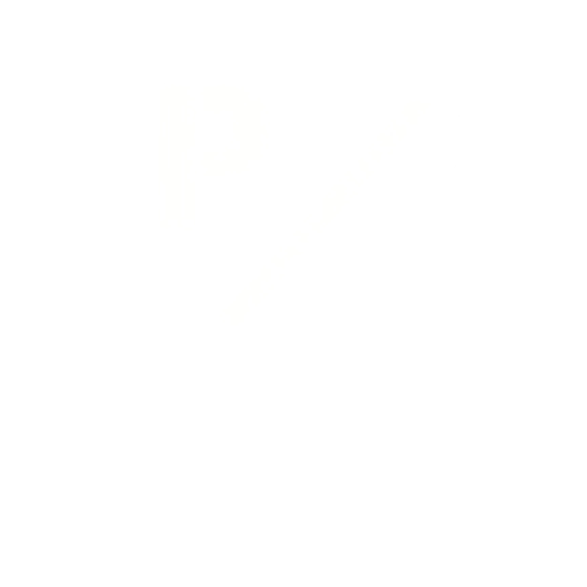

# 🛡️ PhishXray

<div align="center">



**A multi-layered phishing detection web application**

*Detect malicious URLs, websites, and scam messages using ML + Behavioral Analysis*


</div>

---

## 📌 About

**PhishXray** is a full-stack phishing detection platform that combines rule-based analysis, behavioral pattern detection, and machine learning to identify malicious links, fake websites, and scam messages.

Built as a solo project by a BCA student — designed to protect everyday users from online phishing attacks.

---

## ✨ Features

### 🔗 Link Scan
- Fast URL analysis — Safe / Phishing verdict in seconds
- Google Safe Browsing API integration
- URL structure & pattern analysis

### 🌐 Website Scan
- Deep multi-layer analysis
- SSL Certificate validation
- Domain Age via WHOIS lookup
- TLD & keyword analysis
- Risk score 0–100 with full breakdown
- Dual response — Technical + Simple English

### 💬 Message Scan
- Behavioral pattern detection (not just keywords)
- Detects: Urgency, Reward/Bait, Impersonation, Action Demand, Callback Scams
- Screenshot analysis via OCR (Tesseract)
- Phone number + context analysis

### 📧 Email Scan
- `.eml` / `.msg` file upload support
- Header analysis (SPF, DKIM, DMARC)
- Embedded link extraction & scanning

### 🤖 ML Model
- Trained on spam/phishing dataset
- TF-IDF Vectorizer + Logistic Regression
- Integrated into message scan pipeline
- Data collection for continuous improvement

### 👤 User Features
- JWT Authentication (Signup / Login)
- Profile management
- Personal Scan History with full details
- Pagination support

### 🛠️ Admin Panel
- User management (Block / Unblock)
- All scan logs with filters
- Stats dashboard — Total, Dangerous, Suspicious, Safe

---

## 🧱 Tech Stack

| Layer | Technology |
|-------|-----------|
| Frontend | React.js, CSS Modules |
| Backend | Python, Flask |
| Database | MongoDB (PyMongo) |
| Auth | JWT (JSON Web Token) |
| ML | scikit-learn, TF-IDF |
| OCR | Tesseract, Pytesseract |
| Security | bcrypt, CORS |

---

## 📁 Project Structure

```
PhishXray/
├── backend/
│   ├── app/
│   │   ├── routes/
│   │   │   ├── admin.py       # Admin APIs
│   │   │   ├── auth.py        # Auth APIs
│   │   │   └── scan.py        # Scan APIs
│   │   ├── utils/
│   │   │   ├── link_analyzer.py      # URL/Website analysis engine
│   │   │   ├── message_analyzer.py   # Message behavioral analysis
│   │   │   ├── email_analyzer.py     # Email header analysis
│   │   │   ├── predict.py            # ML prediction
│   │   │   └── train_model.py        # ML model training
│   │   ├── models.py          # User model
│   │   ├── mongo_client.py    # MongoDB connection
│   │   └── __init__.py
│   ├── requirements.txt
│   └── run.py
│
└── frontend/
    └── src/
        ├── dashboard.js       # Main scan dashboard
        ├── profile.js         # User profile + scan history
        ├── admin.js           # Admin panel
        ├── signup.js          # Auth page
        ├── forbidden.js       # 403 page
        ├── NotFound.js        # 404 page
        └── UserContext.js     # Global auth state
```

---

## 🚀 Installation & Setup

### Prerequisites
- Python 3.10+
- Node.js 18+
- MongoDB (local or Atlas)
- Tesseract OCR (for screenshot scan)

### Backend Setup

```bash
cd backend
pip install -r requirements.txt
```

Create `.env` file in root:
```env
DATABASE_URL=mongodb://localhost:27017/phishxray
GOOGLE_API_KEY=your_google_safe_browsing_api_key
JWT_SECRET=your_strong_secret_key
PORT=8080
```

Run backend:
```bash
python run.py
```

### Frontend Setup

```bash
cd frontend
npm install
npm start
```

---

## 🔑 Environment Variables

| Variable | Description |
|----------|-------------|
| `DATABASE_URL` | MongoDB connection string |
| `GOOGLE_API_KEY` | Google Safe Browsing API key |
| `JWT_SECRET` | Secret key for JWT tokens |
| `PORT` | Backend port (default: 8080) |

> ⚠️ **Never commit `.env` to GitHub!**

---

## 📊 Detection Layers

```
URL/Message Input
       ↓
┌──────────────────────┐
│  1. URL Structure    │  IP, @symbol, hyphens, length
│  2. TLD Analysis     │  Suspicious TLDs (.tk, .xyz)
│  3. Keyword Check    │  Brand + suspicious combos
│  4. SSL Certificate  │  Valid/Invalid, expiry
│  5. Domain Age       │  WHOIS lookup
│  6. Safe Browsing    │  Google API
│  7. Behavioral       │  Urgency, bait, impersonation
│  8. ML Model         │  TF-IDF + Logistic Regression
└──────────────────────┘
       ↓
   Risk Score (0-100)
   Safe / Moderate / Suspicious / Dangerous
```

---

## 🛡️ Security

- JWT token authentication on all protected routes
- bcrypt password hashing
- Admin-only routes with role verification
- `.env` excluded from version control
- CORS configured

---

## 👨‍💻 Developer

**Rathva Roshan** — BCA Student  
Solo project — Full Stack + ML + Security

---

## 📄 License

This project is licensed under the MIT License.

---

<div align="center">
  <sub>Built with ❤️ by Rathva Roshan</sub>
</div>